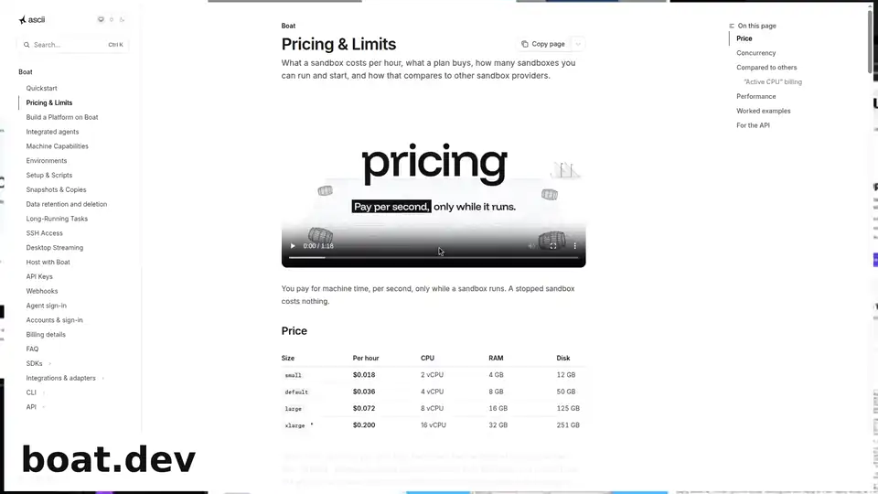

# Battleships

[](https://battleships.dev/wall.mp4)

<sub>Every pricing page, read by an agent in a real browser inside boat.dev VMs, using the pi harness and Claude Haiku 4.5.</sub>

What would your agents cost to run on each of 366 cloud sandbox, VM and runtime providers? Battleships prices your workload the way each provider bills it, from their public pages, with a quote behind every answer.

**[battleships.dev](https://battleships.dev)**: describe your workload or pick a use case, and see who fits, what it costs, and what you'd give up.

## For agents

Don't scrape the page. Everything is published as static files:

- [`/llms.txt`](https://battleships.dev/llms.txt): the map, start here
- [`/data/index.json`](https://battleships.dev/data/index.json): every provider, with links to its files
- `/data/providers/<id>.json` and `.md`: full pricing, features, and the quoted evidence behind each one
- `/data/rankings/<preset>.json`: the ranking for each use case, as the page computes it
- [`/engine.js`](https://battleships.dev/engine.js): the pricing engine, to price your own workload in Node

## How it's made

1. **Read.** Agents open every pricing page and doc in a real browser.
2. **Quote.** Every answer links to its source and quotes it word for word. No quote, no answer.
3. **Price.** One engine bills your usage the way each provider does: per second, minimums, idle time, starts, plans, seats.
4. **Rank.** Full matches first, cheapest on top. The rest show what they miss.

Unknown stays unknown: a price or limit a provider doesn't publish is never treated as free or unlimited. The same rules apply to boat.dev, which built this.

## Corrections and contributions

Found a wrong price, a missing feature or an outdated limit? **[Open an issue](https://github.com/ariana-dot-dev/battleships/issues/new)** with:

- the provider,
- what's wrong,
- a link to the provider's own public page, with the sentence that says so.

That quote is what we need. We don't change data on word of mouth, private deals or screenshots of dashboards, and that goes for providers too: if you run one, point us to your public page.

Pull requests are welcome. Each provider is one file, `research/cards/<id>.json`. Put the source URL and the exact quote in the PR description, then check the result:

```sh
cd site && node build.js   # builds site/dist/index.html
node check.js              # prices every provider under the use cases
```

Want a provider added? Open an issue with its pricing page.

## Layout

- `site/`: the page (`template.html`), the pricing engine (`engine.js`), the build and the agent files
- `research/cards/`: one JSON file per provider: billing regimes, plans, features, network, sources
- `research/regimes/`, `research/verify/`: how each provider charges, and the checks behind the numbers
